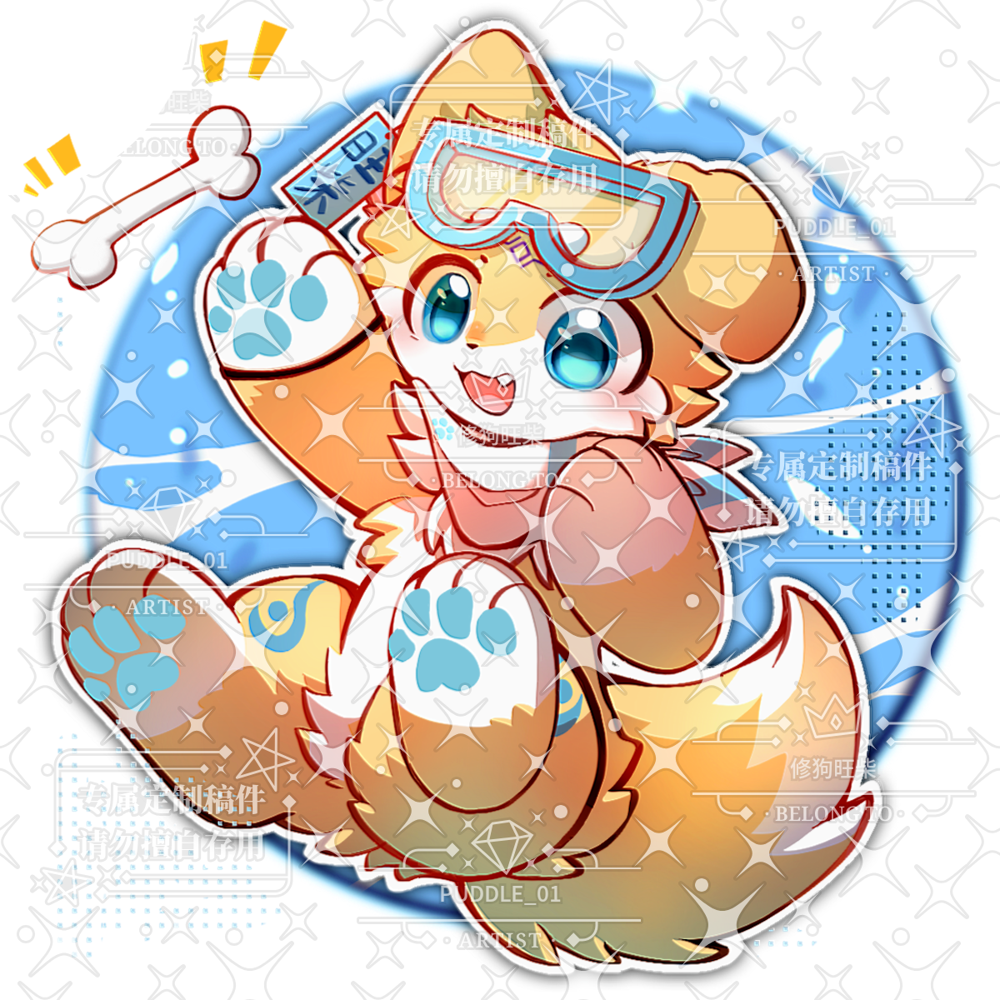
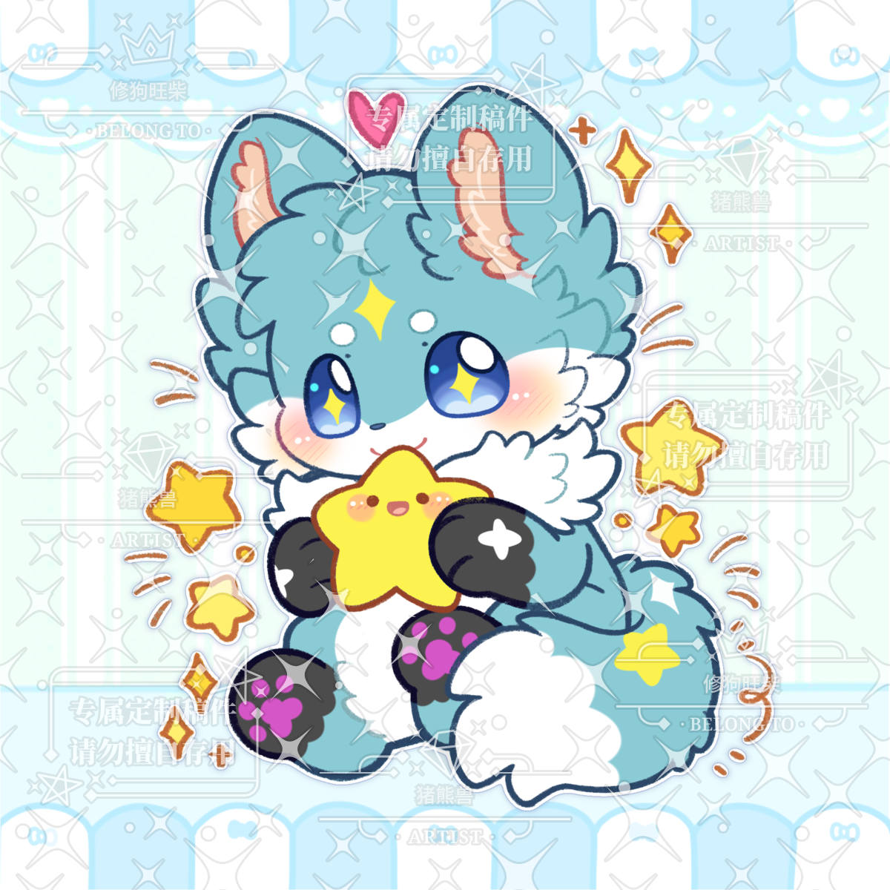

Oh! ~~You find a lazy but intresting dog!~~

# About me🧐
Hi! I'm Chen Bowen(陈博文). This is a common name, isn't it? 
So I make a ~~commoner~~ nickname for me and my original character(oc) --- Cheerdoge(旺柴). Yes, he is a cute doge🐶. I like cute animals🥰🥰
Maybe you have found that my English isn't well😢😢, please forgve me, thanks~
***
# About my hobby🥰
## 🎮️game🎮️
   ZZZ, Identity V and Party Animals are my favorite games. 
## 😴deepsleep😴
   I can't refuse sleep in warm quilt at rainy and cold day. It's so comfortable that I can't leave my bad🥺🥺.
## 🐾furry🐾
   I like cute things!🥰 They make world better!
   I have two cute oc. They are cute and I'm glad to introduce them to you.
   * 🦴Cheerdoge(旺柴)🦴
    He is a **Shiba Inu**🐶 which likes playing game. He is created by one of my best friends🥰. When I perfected his character design, I basically modeled it after my self. Here is he!
   * ⭐Cynosure(辰戌)⭐
    This is **my first original character** which was created all by myself. I wish he is **the symbol of the meteor✨ and wishes**, but he is a dog🐶, too.(🥰\I like dog! Please support dog!) So I use the elements of stars to creat it. His original name is Stelle, but I change it to Cynosure.They all have meaning of stars.
---
# About my study🤓
~~Can we not talk about this topic?🥺🥺~~
To be honest, I'm not a hard-working person😭. But I kown I should fix it and I'll try my best🥺.
I'm studying **GO**, **C**, and **C++**. Although I study GO in most time, I will make myself to study other languages.
***
That's all! Nice to meet you🥰!